# **Licensed vehicles and AQI Analysis**
### **Kahan Dave**
</br></br>

## **Introduction**
****


<div style="text-align: justify">
  <blockquote>
 India is a vast country with a billion people residing in it. However, with that much of a population, transportation plays a vital role. Moreover, with more vehicles, there should be more pollution. The capital of India, Delhi, and my city Ahmedabad are such places where pollution and population is a major issues. Also, transportation through vehicles is one such factor that fuels pollution but with such a huge population it might play a vital role in increasing pollution. Hence, this analysis on the relationship between AQI and licensed vehicles.
  </blockquote>
</div>

</br></br>

## **Data files that I have utilised**
****

<div>
 <blockquote>
   
[city_day.csv](https://www.kaggle.com/datasets/rohanrao/air-quality-data-in-india) :- Contains daily data of greenhouse gases like PM10, PM2.2, O3, SO2, Benzene in ppm from 2015 to 2020. Moreover, it also store the AQI Index and the AQI Bucket affiliated with it. Also, it has data from each major cities from India.
</br></br>

[Delhi.xlsx](https://www.statista.com/statistics/665712/total-number-of-vehicles-registered-in-delhi-india/) :- Contains registered vehicles of Delhi from 2015 to 2020.
</br></br>

[Ahmd.xlsx](https://www.statista.com/statistics/665754/total-number-of-vehicles-in-ahmedabad-india/) :- Contains registered vehicles of Ahmedabad from 2015 to 2020.

 </blockquote>
</div>

</br></br>

## **Files and folders in this repo**
****

<div>
 <blockquote>

**Images** :- Contains all the graphs that were generated during exploratory data analysis.

**Data** :- Contains all the data files that were utilized. These files were either outsourced from the internet or were generated during data pre-processing.

**Project.ipynb** :- Contains all the data pre-processing and exploratory data analysis that took place.

**Project.py** :- Just a executable script for the notebook version.

 </blockquote>
</div>

</br></br>

## **Data Pre-processing**
****

<div style="text-align: justify">
 <blockquote>
  All the important libraries that are neccesary for the project. 
  </br></br> 

```python
import pandas as pd
import csv
import numpy as np
import seaborn as sns
import sys
import matplotlib.pyplot as plt
import plotly.graph_objects as go
%matplotlib inline
```
pandas, csv, sys and numpy for data manipulation & seaborn matplotlib and plotly for data visualisation.
 </blockquote>

</br></br>

 <blockquote>
 Reading the data file to take a look at what is actually going on inside.
 </br></br> 

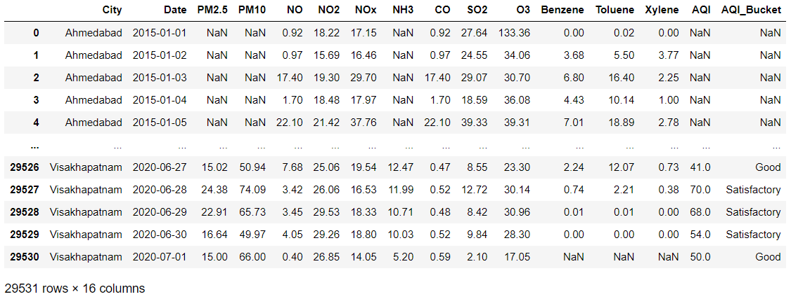

</br></br> 

 </blockquote>

</br></br>

<blockquote>
Fetching data for Ahmedabad and Delhi. Also checking their null values.
 </br></br> 

```python
city = ["Ahmedabad", "Delhi"]
ad = df.loc[df['City'].isin(city)]
ad.isna().sum()
```
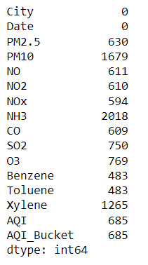

</blockquote>

 </br></br> 

<blockquote>
Seperating Ahmedabad and Delhi from the above dataframe.
</br></br>

```python
 amd = ad.loc[df['City'] == "Ahmedabad"]
```

```python
dhl = ad.loc[df['City'] == "Delhi"]
```
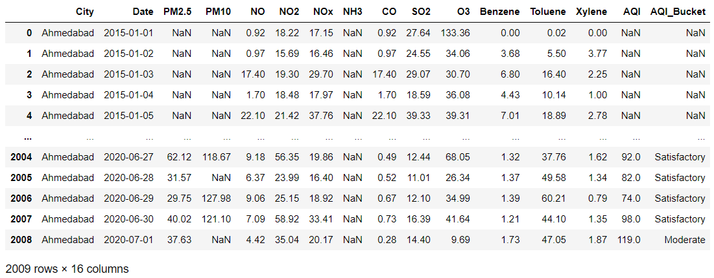
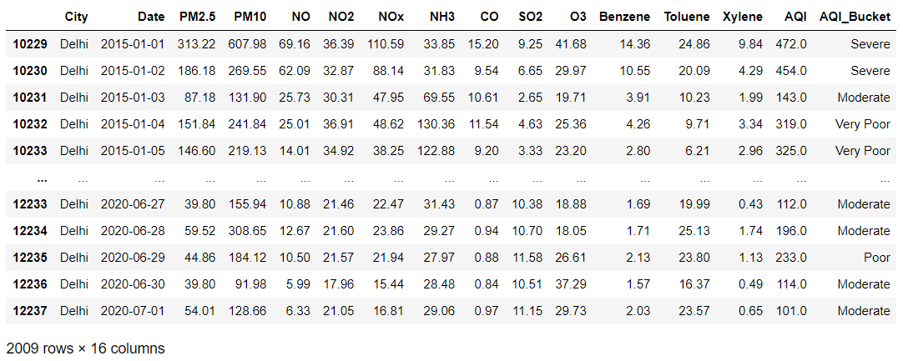


</blockquote>

</br></br>

<blockquote>

Describing both the data to fetch their mean in two different dictionary.
</br></br>

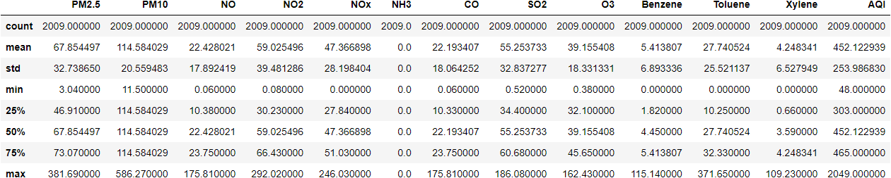
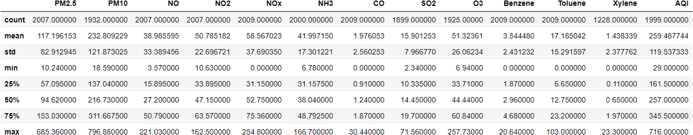

</br></br>

Now let's create two different dictionaries from the above data frame so that I can swap all the null values with their respective average values. This has to be done this way because there was a lot of missing data and just dropping those null data did not make much sense. Also, there were missing data cells for over 10-15 days so it also makes it difficult to replace null values with the average of its previous and next values.

</br></br>

```python
ameans = {"PM2.5": 67.854497,
         "PM10": 114.584029,
         "NO": 22.428021, 
         "NO2": 59.025496,
         "NOx": 47.366898,
         "NH3": 0,
         "CO": 22.193407,
         "SO2": 55.253733,
         "O3": 39.155408,
         "Benzene": 5.413807,
         "Toluene": 27.740524,
         "Xylene": 4.248341,
         "AQI": 452.122939}

amd = amd.fillna(ameans)

```
```python
dmeans = {"PM2.5": 117.196153,
         "PM10": 232.809229,
         "NO": 38.985595, 
         "NO2": 50.785182,
         "NOx": 58.567023,
         "NH3": 41.997150,
         "CO": 1.976053,
         "SO2": 15.901253,
         "O3": 51.32361,
         "Benzene": 3.544480,
         "Toluene": 17.185042,
         "Xylene": 1.438339,
         "AQI": 259.487744}


dhl = dhl.fillna(dmeans)
```

</blockquote>

</br></br>

<blockquote>
Concatenating the above dataframes that we got after swapping the null values with their respective average values.


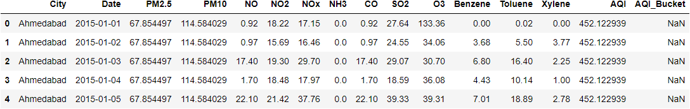

I still have null values in AQI_Bucket column. It is to be expected as it is categorical data and it can not be swapped byt its mean value.

</blockquote>

</br></br>

<blockquote>
Solving this issue in excel and for that let's convert the dataframe into csv using pandas.
</br></br>

Using conditional range formula on AQI_Bucket column in excel can do the job.
</br></br>

[AQI_Bucket Reference](https://www.linkedin.com/pulse/breaking-down-aqi-air-quality-index-abhishek-soni/)

```excel
=If(O2<50,“Good”,If(O2<100,“Satisfactory”,If(O2<150,”Moderate”,If(O2<200,”Poor”,If(O2<300,”Very Poor”,If(O2<500,”Severe”,”A”))))))
```

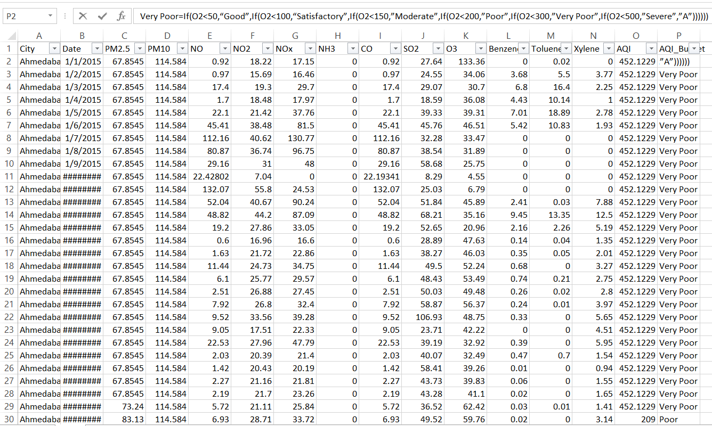

</blockquote>

</br></br>

<blockquote>
Reading the freshly altered CSV file and creating a data frame out of it. Now, sorting the data frame first with City and then with Date so that we can get data in terms of date but with cities sorted as well. After doing that I am going to group them by date with the frequency of a year with their respective average values for the whole year.
</br></br>

```python
dffad =pd.read_csv("Data/FAD.csv", parse_dates=['Date'])
sorting=["City", "Date"]
dffad.sort_values(by=sorting, inplace=True)
sortDffad=dffad
sortDffad=sortDffad.groupby(pd.Grouper(key='Date', axis=0, freq='Y')).mean()
sortDffad
```

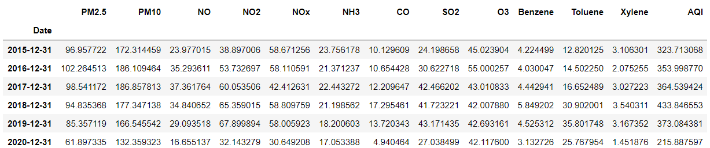

Now lets change the format of the date so that I can get onle the year instead of the whole date. To do this properly I created a different csv from the above dataframe and then read that csv in this step.

```python
saqi = pd.read_csv("Data/saqi.csv")
saqi["Date"] = pd.to_datetime(saqi.Date)
saqi['Date'] = saqi['Date'].dt.strftime('%Y')
saqi.rename(columns = {'Date':'year'}, inplace = True)

saqi
```
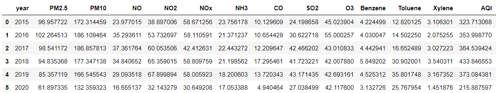


</blockquote>

</br></br>

<blockquote>
Now lets check out the licensed vehicle dataset and see what exactly is going on there.
</br></br>

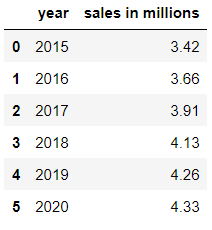
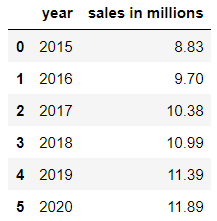

Merging the above two dataset so that I can get a total amount of sales in both the cities together.

```python
aadd = pd.merge(ahmd, delhi, how='inner', on = 'year')
aadd['Licensed vehicle'] = aadd['sales in millions_x'] + aadd['sales in millions_y']
aadd.rename(columns = {'sales in millions_x':'Ahmedabad', 'sales in millions_y':'Delhi'}, inplace = True)
```
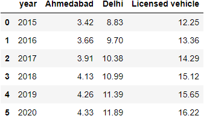


</blockquote>

</br></br>

<blockquote>

Merging the AQI dataset with the licensed vehicles dataset using inner join.

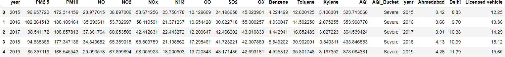

As there are two columns whose name is year, I would like to remove one column for better clarity and easy analysis.

```python
maadd = maadd.loc[:,~maadd.columns.duplicated()].copy()
maadd
```
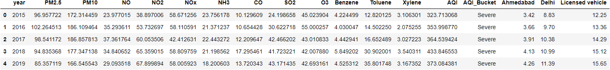


</blockquote>

<blockquote>

Upon creating the above data frame I got shocked that there were 16.22 licensed vehicles during 2020 as there was COVID-19 everywhere. Then I realized that it was not the total vehicles that were sold but the number of licensed vehicles that were there during 2020. However, that can create some issues during analysis, hence I added a growth column so that I can get an idea about how much the growth in the licensed vehicle from last year.

Doing this gave me the first-row cell of the Growth column empty as there can be no difference so I just replaced the null value with 0.
</br></br>

```python
maadd["Growth"] = pd.DataFrame(maadd["licensed vehicles"].pct_change())
maadd = maadd.fillna(0)
maadd
```
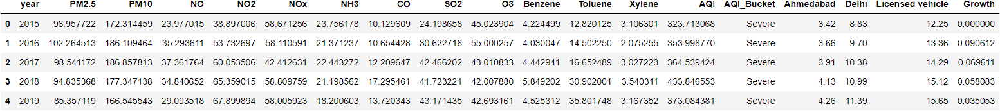

</blockquote>

</br></br>

## **Exploratory data analysis**
****

<blockquote>
Typically a vehicle emits CO, NOx, NO, NO2, PM10, PM2.5, SO2, Benzene& O3. Hence, lets find if with growing licensed vehicles does these emission fairly increases or not.
</blockquote>

</br> </br>

<blockquote>
Plotting a simple bar graph of licensed vehicles and growth against year to get a rough idea of thier increase.
</br></br>


**Learnings** :- licensed vehicles are increasing steadily over years. However, its growth fell after 2018 and only increased a bit in 2020. This could be due to COVID-19, car sales took a toll and were low causing the growth to be so less.

</blockquote>

</br></br>

<blockquote>
Plotting subplots of each gas emitted from vehicles against year to se their distribution during those five years.
</br></br>


**Learnings** :- As the growth vs year graphs suggested, these plots are following the same direction as most of the gas distribution fell heavily during 2020. However, ground-level ozone was still prevailing, but as we saw earlier there was only 0.03% of growth in licensed vehicles during 2020, ground-level ozone might be getting emitted due to other different sources.

</blockquote>

</br></br>

<blockquote>
Creating a data frame that contains the mean value of all the emitting gases so that I can create a pie chart to get an idea of how much was their portion during those five years.
</br></br>

```python
maadddesc = maadd.describe()
maaddMean = maadddesc.loc["mean"]
maaddMean = maaddMean.drop(["NH3", "Toluene", "Xylene", "AQI", "Ahmedabad", "Delhi", "licensed vehicles", "Growth"], axis=0, inplace=False)
maaddMean
```
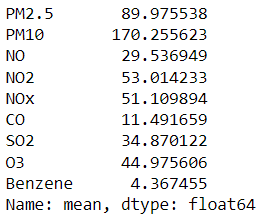


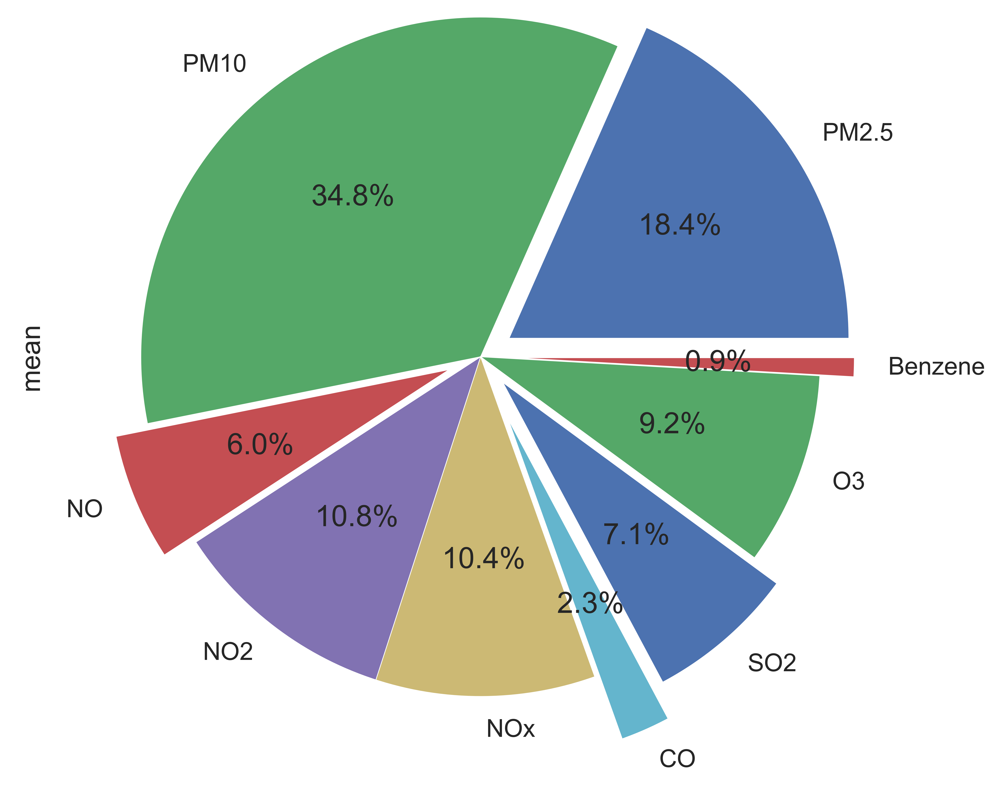

**Learnings** :- As the cart suggests PM10 was present at maximum in the atmosphere. However, PM2.5, NO2, and NOx were also present conclusively. On the opposite side of the spectrum, benzene, O3, SO2, and CO were very less present.

</blockquote>

</br></br>

<blockquote>

Getting the correlation coefficient of each emitting gas against licensed vehicles to get clarity that how much are they related to each other. Also, I am appending those values in a dataframe for further and final analysis.

```python
iv = ["CO", "NOx", "NO", "NO2", "PM10", "PM2.5", "O3", "SO2", "Benzene"]
corrdata = pd.DataFrame()
for i in iv:
    print("Correlation coefficient of {} is".format(i), maadd['licensed vehicles'].corr(maadd[i]))
    v = maadd['licensed vehicles'].corr(maadd[i])    
    df2 = {'Gas Name': i, 'Corr Coef': v}
    corrdata = corrdata.append(df2, ignore_index = True)  

corrdata
```
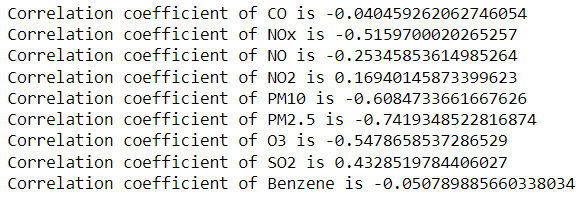
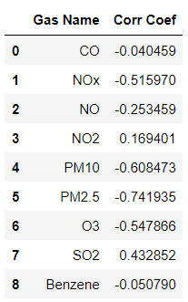

</blockquote>

</br> </br>

<blockquote>
Plotting a simple bar graph of the above dataframe to get an idea of how much correlation is there.
</br></br>


**Learnings** :- NOx, PM10, PM2.5, O3, and SO2 are highly correlated with licensed vehicles. However rest of them, we can ignore.

</blockquote>

</br></br>

## **Conclusions**
****

<blockquote>

 **First Conclusion :-**  Even though growth of licensed vehicles decreased during 2019 & 2020, ground level ozone was showing no major difference, leading to licensed vehicles have not much difference to AQI Index.

 **Second Conclusion :-**  As the pie charts says that PM10 has a very conclusive presence, vehicles only has 10% contribution to PM10 emission ou of all the other elements.

 **Third Conclusion :-** Even though vehicle emits maximum amount of benzene in the atmosphere, it only has a presence of 0.9% during the 5 years span. Even during 2018, benzene's presence was not making much difference.

 **Final Conclusion :-** I would like to conclude after this analysis that licensed vehicles might be one of the factors for AQI_Index but it is not a major factor, nor does it directly affects the AQI_Index.       

</blockquote>

</br></br>

## Other Important Citations
****
#### These citations are regarding vehicle emissions and their effects which I have used as a reference for my conclusions.

</br>

[www.nature.com](https://www.nature.com/articles/s41598-021-00862-x#:~:text=The%20U.S.%20Environmental%20Protection%20Agency,of%20PM2.5%20emissions15)

[www.pubmed.ncbi](https://pubmed.ncbi.nlm.nih.gov/15757346/)

[www.springeropen.com](https://etrr.springeropen.com/articles/10.1007/s12544-017-0263-7)

[www.epa.gov](https://www.epa.gov/no2-pollution/basic-information-about-no2
)
</div>
